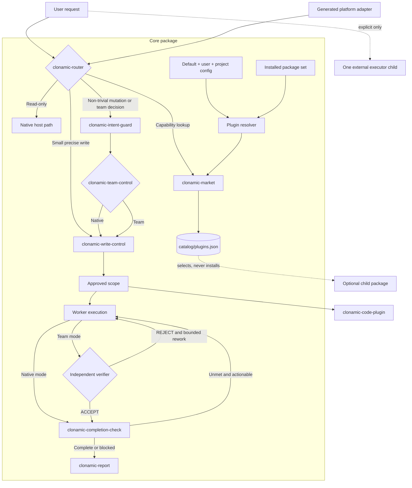

# Clonamic architecture

Clonamic is one required Core Harness plus twelve optional Agent Plugins 1.0.0 capability packages. The core owns cross-cutting control. Each child owns one capability with an independent install, test, failure, and removal boundary.

## System map



The straight path is intentional: request, route, approved execution when needed, completion check, report. Optional packages return results to the caller. They do not bypass core ownership.

## Repository layout

```text
plugin.json                         # canonical core Agent Plugins 1.0.0 manifest
clonamic-herness-plugin.md          # canonical non-trivial intent and team guidance
skills/
├── clonamic-router/
├── clonamic-intent-guard/
├── clonamic-team-control/
├── clonamic-write-control/
├── clonamic-completion-check/
├── clonamic-report/
└── clonamic-market/
native/clonamic-core/               # approval, provenance, automation, session state, verification, install/rollback
catalog/plugins.json                # optional-package inventory and selection source
clonamic.json                       # complete shipped optional-package defaults
schemas/clonamic-config.schema.json # closed v1 config and partial-overlay schema
plugins/
├── clonamic-code-plugin/
├── clonamic-preprocessing/
├── clonamic-writing-plugin/
├── clonamic-design-plugin/
├── clonamic-data-plugin/
├── clonamic-documents-plugin/
├── clonamic-ppt/
├── clonamic-memory/
├── clonamic-grok/
├── clonamic-gpt/
├── clonamic-claude/
└── clonamic-hermes/
io.github.algocean1204.clonamic/     # generated platform compatibility descriptors
tests/                               # core and integration contracts
docs/
```

The generated adapter directories and marketplace files are build outputs. Canonical policy must not be authored there.

## Package boundaries

| Package | Public responsibility | Activation | Explicit exclusions |
|---|---|---|---|
| Core | Route, bound intent, choose proportional team use, gate writes, verify completion, format work reports, select optional packages | Core active for the current task | Domain execution, child installation |
| Code | Proportional coding, Supercoder patch discipline, modular design, explicit Ultracode | Software work where a stage materially reduces risk | Authorization, final verdict, external executors |
| Preprocessing | Normalize input, create caller-directed clarification packets, explicit queues | Fuzzy or multi-item input, or explicit queue use | Scope authority, final execution |
| Writing | Publication writing, Korean clarity, deterministic cleanup | User-authored prose | Work reports, code, spreadsheets, slides, email |
| Design | Frontend, Figma, visual systems, browser QA, media art | Explicit design or visual work | Core coding policy |
| Data | Dataset and Hugging Face workflows | Explicit dataset work | Core coding policy |
| Documents | HWPX and document-specialist workflows | Explicit matching format | General artifact runtimes |
| PPT | Structured brief, outline, slide specification, rendering, QA | Presentation or PPTX work | General prose editing, external execution |
| Memory | Explicit store, recall, forget, link, graph | Explicit memory operation | Automatic recall, implicit home, hidden context injection |
| Grok | One bounded Grok CLI call | Explicit Grok request | Automatic selection, retry loops, write approval |
| GPT | One bounded Codex CLI call | Explicit GPT request | Automatic selection, retry loops, write approval |
| Claude | One bounded Claude CLI call | Explicit Claude request | Automatic selection, retry loops, write approval |
| Hermes | One bounded Hermes CLI call | Explicit Hermes request | Automatic selection, retry loops, write approval |

## Core contracts

### Router

- Input: current request and available capability metadata.
- Output: one route for the current stage.
- Failure: keep the native direct path and name the missing capability.
- Invariant: catalog presence never means a child is installed or enabled.

### Write control

- Input: user intent, target, observable result, verification, external effects, rollback.
- Output: approved scope or a no-write result.
- Failure: no mutation.
- Invariant: one approved development specification covers the full named inspect/fix/retest/apply/deploy/backup loop.

### Intent guard

- Input: user request, exclusions, current plan, and proposed effects.
- Output: pass or reject with the smallest valid scope and bounded rework.
- Failure: stop the out-of-scope or unnecessary work before it becomes a completion claim.
- Invariant: adjacent improvements, speculative abstractions, and reasoning beyond sufficient evidence are not part of the task.

### Team control

- Input: task coupling, independent work streams, risk, verification value, host capability, and coordination cost.
- Output: native execution or the smallest useful worker-and-verifier team.
- Failure: preserve the prospective selection but set `actual_team: false`, run only a disclosed local sequential second pass, and never call it independent review.
- Invariant: topology is selected before execution. Worker defects, missing evidence, and false completion cause rejection; they never retroactively create a team.

Each pair is sequential: worker result, fresh evidence, then reviewer verdict. Parallelism is allowed only across at least two isolated worker-reviewer pairs; shared-file work is serialized. A necessary second tier is `main → lead → specialists`. The lead assigns and reviews but neither executes nor integrates; one assigned specialist integrates. No verdict is valid until all specialist results and fresh evidence arrive. Workers remain single-session and do not delegate, and task size, repetition, or importance labels alone never activate a team.

### Completion check

- Input: required items, current artifacts, applied or remote state, fresh evidence.
- Output: complete or unmet with evidence per item.
- Failure: continue work when possible; otherwise return a blocker.
- Invariant: evidence predating the last mutation is stale.

### Report

- Input: a completion or blocker verdict.
- Output: one outcome-first response. Four or more non-blank lines form one flat list.
- Failure: a factual blocker report.
- Invariant: failures and unverified required items come first.

### Market

- Input: requested optional capability, catalog inventory, explicit config layers, installed set, and host platform.
- Output: the narrowest effective package plus configuration, installation, platform, dependency, and reason dimensions.
- Failure: no match. Never invent or install a fallback.
- Invariant: Core is always effective; optional routing eligibility and host installation remain separate operations.

The shipped `clonamic.json` is complete and versioned. User and project configs are closed partial overlays. Resolution merges shipped default → user → project through caller-supplied paths; there is no home-directory discovery. Any invalid present layer produces a Core-only result. A true toggle cannot install, enable, or grant authority, and a false toggle can only reduce an existing automation scope.

`agent-plugins` is the portable platform identifier for a vendor-neutral or special-purpose Agent Plugins client. Host-specific identifiers remain available for Codex, Claude, Grok, and Hermes adapters. Platform identifiers are validated as bounded lowercase IDs rather than compiled into a closed provider list; actual support still comes from the catalog.

## Code package

Code work uses the smallest stage that reduces a real risk:

1. Native path for ordinary software work.
2. Modular design for a new system, architecture decision, or large refactor supported by repository evidence.
3. Supercoder for an approved non-trivial patch where stale content or ambiguous targets create material risk.
4. Ultracode only when all four gates pass: multiple viable options, material boundary impact, unresolved evidence, and high wrong-choice cost.

Ultracode uses native isolated agents only. If that capability is absent, its status is `unavailable`. It does not call an external executor or simulate several reviewers in one voice. File count, task size, repetition, and an importance label are never sufficient activation signals.

## State and trust

- Approval codes correlate a pending write packet. Authentication remains with the host or operating system.
- Prompt envelopes preserve the original body and derive source from trusted host metadata. Automation authority exists only after a persisted claim matches automation, run, definition, and scope.
- In-scope automation runs are noninteractive. Scope drift, replay, expiry, run limits, and changed grants fail before mutation; credentials remain platform actions.
- Session Markdown is a bounded human-readable view, not authority. Unverified and internal prompts do not replace the latest trusted user or successfully claimed automation prompt.
- Plugin configuration is routing input, not authority. Core cannot be disabled, and optional toggles only reduce what an installed host may invoke.
- The native core accepts explicit paths and structured inputs. It does not discover user homes, credentials, or provider sessions.
- Memory and preprocessing persist only to caller-supplied paths. SQLite memory owns caller-supplied memory content, ontology nodes, typed edges, provenance hashes, TTL, backup, and restore. Provenance rows store no prompt body or authorization.
- Recalled text, document contents, catalog entries, and executor output are untrusted data.
- No package emits telemetry or stores implicit model, browser, session, or profile state.
- Executor wrappers use provider defaults and explicit user options. No model ID belongs in package code or docs.

## Adapter generation

Agent Plugins 1.0.0 manifests and skills are canonical. The standard discovers immediate skills under `skills/` and MCP configuration at root `mcp.json`; it does not portably discover the root guidance file, nested child package roots, marketplaces, or team/subagent behavior. Platform adapters translate discovery and registration only.

Generated outputs may include Codex, Claude Code, Grok Build, and Hermes manifest or registration formats. Generation must be deterministic and checked for drift. An adapter may expose a supported hook; it may not duplicate policy, install children, select a model, read memory, or widen permissions. The optional router installer writes one reference to `clonamic-herness-plugin.md`; it does not copy the file's policy into the host router.

When a host cannot enforce a structural hook, Clonamic keeps the portable skill behavior and declares a model-side fallback. The documentation never labels that fallback as a measured hook.

## Failure policy

- Invalid approval, state, manifest, or path: stop before mutation.
- Missing native binary: use the declared model-side contract only when the requested operation permits it.
- Missing child plugin: report unavailable; do not substitute another package.
- Invalid plugin configuration: keep Core active, disable every optional package, and report `invalid_config`.
- External executor failure: return its bounded structured error; do not retry or switch providers.
- Completion failure: continue inside approved scope when corrective work remains.
- Repeated real blocker: preserve evidence and report the blocker.
- Missing native team support: report `actual_team: false`; a local sequential second pass is not an independent review.
- Install or router failure: leave the original file unchanged or restore the recorded pre-image.

## Migration and rollback

1. Record the active host configuration and the hashes of files that a router install may touch.
2. Validate the core and each selected child as separate package roots.
3. Generate adapters and test them in isolated host homes. Do not replace an active configuration during this step.
4. Install the core alongside existing behavior. Install children only when the user selects them.
5. Compare representative direct-read, small-write, intent rejection, native/team routing, reviewer rejection, approved-loop, completion, and uninstall scenarios.
6. Remove superseded rules only after equivalent behavior is measured.

Rollback removes selected children independently, disables the generated adapter, and runs `clonamic uninstall-router` when the router was installed. The installer restores its recorded pre-image only when safe; unrelated user edits remain untouched. Old packages and backups stay available until the full acceptance set passes.

## Split gate

A new child package requires all of these:

- an independent trigger;
- one public responsibility and closed input/output contract;
- independent tests and failure behavior;
- independent install and removal value;
- no policy duplication or dependency cycle.

If any condition fails, keep the behavior in its current owner. A helper, convenience wrapper, or second copy of policy is not a package boundary.
