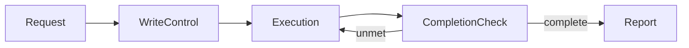

# Clonamic Herness Plugin design

- Scale: medium
- Product: portable AI coding-agent judgment and write-control plugin
- Runtime: Markdown skills plus one Rust core binary
- Platforms: Codex, Claude Code, Grok Build, Hermes
- Modules: four behavior modules, one native core, four thin adapters

## Technology

| Area | Choice | Reason |
|---|---|---|
| Shared behavior | Agent Skills Markdown | Common discoverable format with progressive loading |
| Structural core | Rust | Cross-platform binary, typed state, atomic file operations |
| Manifests | JSON / YAML | Native platform formats |
| Hermes adapter | Python | Required `register(ctx)` surface |
| CI | GitHub Actions | macOS, Linux, Windows matrix |

## Structure

```text
plugins/clonamic-herness-plugin/       # plugin composition root
├── core/AGENTS.md                     # three-line routing root
├── skills/                            # behavior modules
├── commands/                          # explicit executor commands
├── native/clonamic-core/              # Rust library + CLI
├── plugin.yaml + __init__.py          # Hermes adapter
├── .codex-plugin/                     # Codex adapter
├── .claude-plugin/                    # Claude adapter
└── .grok-plugin/                      # Grok adapter
```

## Main pipeline



## Module contracts

### F1 Write control

- IN: user request, project facts, platform capabilities
- OUT: `WriteDecision { lane, specification, approval_required, approved_scope }`
- FAIL: no mutation; return a concise blocker
- PUBLIC: `clonamic-write-control/SKILL.md`
- REMOVE: delete the skill and remove its single router line

### F2 Completion check

- IN: required items, artifacts, fresh evidence, external-state observations
- OUT: `CompletionVerdict { complete, unmet, evidence }`
- FAIL: blocker verdict; never completion
- PUBLIC: `clonamic-completion-check/SKILL.md`, `clonamic verify`
- REMOVE: delete the skill and completion router line

### F3 Report

- IN: verified completion or blocker verdict
- OUT: one user-facing report
- FAIL: plain factual fallback
- PUBLIC: `clonamic-report/SKILL.md`
- REMOVE: delete the skill; host reporting returns to native behavior

### F4 Executors

- IN: explicit slash command and bounded task packet
- OUT: one executor result
- FAIL: target-unavailable result; no substitution
- PUBLIC: `clonamic-executors/SKILL.md`, `commands/`
- REMOVE: delete command files and the skill

### C0 Native core

- IN: explicit paths and JSON data supplied by the adapter
- OUT: typed JSON verdict or declared process error
- FAIL: non-zero exit without widening scope
- PUBLIC: `clonamic_core::{approval, completion, installation}` and `clonamic`
- REMOVE: remove the binary; skills fall back to declared model-only behavior

## Adapter rule

Adapters translate native plugin discovery into the four public modules. They do not duplicate policy, choose models, read memory, or patch platform core files.

## Failure policy

- Invalid approval/state/manifest: halt the write.
- Missing native core: model-only fallback, disclosed when structural enforcement matters.
- Unsupported hook: skip the hook, keep skill behavior.
- Install failure: leave the original router unchanged or restore its backup.
- Completion failure: continue the task; after three failed correction strategies, report a blocker.

## Design decisions

- `[KEEP]` One product plugin: related modules share one user intent and release cadence.
- `[SPLIT]` Four behavior modules: each has independent triggers and test value.
- `[SPLIT]` Rust core from Markdown policy: deterministic state and prose guidance change for different reasons.
- `[VARIANT]` Four adapters: four real plugin contracts exist today.
- `[MERGE]` Prompt refinement and lean-scope judgment stay inside write control because they always run together.
- `[LOCAL]` No shared memory provider: memory is outside the product contract.
- `[LOCAL]` No automatic external model router: explicit user control is a product requirement.

## Migration

1. Publish and validate the new plugin without changing an active environment.
2. Test platform adapters in isolated homes.
3. Compare with the existing harness on representative scenarios.
4. Install the plugin alongside the old harness only after clean-room checks.
5. Remove duplicated old rules after equivalent behavior is measured.
