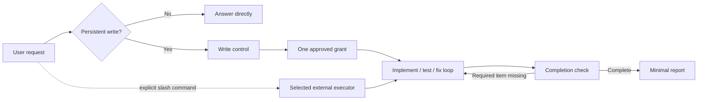

# Clonamic Herness Plugin

[](https://github.com/algocean1204/clonamic-herness-plugin/actions/workflows/ci.yml)
[](LICENSE)

Clonamic adds the same write boundary and completion check to Codex, Claude Code, Grok Build, and Hermes without replacing their native tools, models, sandboxes, or plugin managers.

한국어 요약: 읽기와 의견은 바로 처리하고, 실제 쓰기만 짧게 승인하며, 승인 후 수정 루프는 멈추지 않습니다. 완료 보고 전에는 결과를 다시 검증합니다.

## Why

AI coding agents can lose time in predictable ways: planning a read-only question, asking for the same approval more than once, changing unrelated host configuration, delegating to another model without being asked, or reporting completion before the requested state exists.

Clonamic limits those failure modes with four small modules:

- `clonamic-write-control`: proportional write specifications and one reusable approval;
- `clonamic-completion-check`: fresh evidence before a completion claim;
- `clonamic-report`: short, outcome-first reports;
- `clonamic-executors`: explicit `/grok`, `/gpt`, `/claude`, and `/hermes` routing only.

## Behavior

| Request | Clonamic route |
|---|---|
| Question, explanation, opinion, inspection, review | Direct answer. No specification or approval. |
| Clear persistent write | One development specification and one approval. |
| Materially ambiguous write | Work specification, analysis, then development specification. |
| Approved test/fix/apply/deploy loop | Continue without another approval. |
| Completion claim | Re-check requested items and fresh evidence first. |

Approval codes are correlation identifiers, not authentication factors. `승인:6F0FF3`, `` `승인:6F0FF3` ``, and `승인：6F0FF3` normalize to the same code.

## Pipeline



## Install

### Codex

```text
codex plugin marketplace add algocean1204/clonamic-herness-plugin
codex plugin add clonamic-herness-plugin@clonamic
```

### Claude Code

```text
/plugin marketplace add algocean1204/clonamic-herness-plugin
/plugin install clonamic-herness-plugin@clonamic
```

### Grok Build

```text
grok plugin marketplace add algocean1204/clonamic-herness-plugin
grok plugin install clonamic-herness-plugin --trust
```

### Hermes

Copy `plugins/clonamic-herness-plugin/` to `~/.hermes/plugins/clonamic-herness-plugin/`, then enable it:

```text
hermes plugins enable clonamic-herness-plugin
```

Plugin installation makes the skills available. Structural router enforcement is optional and reversible through the `clonamic` binary:

```text
clonamic install-router <AGENTS.md> <install-state.json> <plugin-root>
clonamic uninstall-router <AGENTS.md> <install-state.json>
```

Release binaries are published with adjacent `.sha256` files. Verify the checksum before putting `clonamic` on `PATH`.

## Portability contract

Clonamic does not ship or migrate memory, sessions, credentials, model choices, MCP connections, approval ledgers, user profiles, or local paths. It does not enable another plugin, choose another AI model, or overwrite an existing configuration file.

The common behavior lives in Markdown skills. Platform adapters use the native plugin surface available on each host. If a platform cannot enforce a hook, Clonamic uses a declared model-only fallback instead of pretending that the hook ran.

## Verify locally

```bash
cargo fmt --check
cargo clippy --all-targets -- -D warnings
cargo test --all-targets
python3 -m unittest discover -s tests -v
```

The public test suite covers approval normalization, expiry, idempotence, concurrent approval, false-completion rejection, corrupt state, install/uninstall byte restoration, manifest structure, skill routing, and private-data scanning.

## Documentation

- [Philosophy](docs/PHILOSOPHY.md)
- [Architecture](DESIGN.md)
- [Compatibility](docs/COMPATIBILITY.md)
- [Benchmark method](docs/BENCHMARKS.md)
- [Contributing](CONTRIBUTING.md)
- [Security policy](SECURITY.md)

## Status

This repository is an early public release. A change is releasable only after the Rust, package, clean-room, and platform-adapter checks pass. Known limitations are recorded in [Compatibility](docs/COMPATIBILITY.md).
