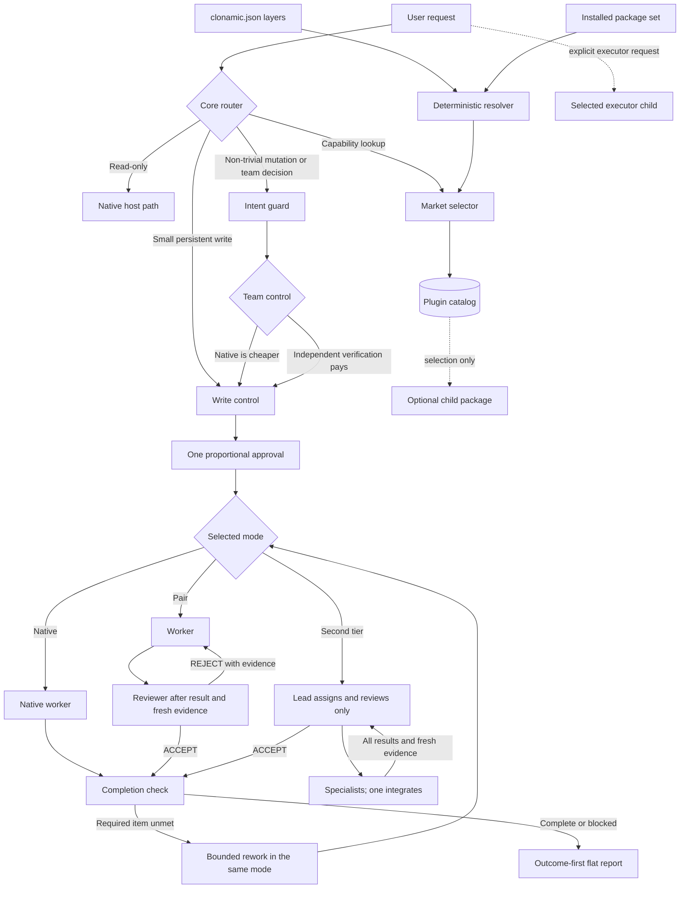

# Clonamic Agent Plugins

[](https://github.com/algocean1204/clonamic-herness-plugin/actions/workflows/ci.yml)
[](LICENSE)

Clonamic keeps read-only and small precise work on the native path, bounds non-trivial work against user intent, creates a worker-and-verifier team only when its value exceeds its coordination cost, puts one proportional gate in front of persistent writes, and verifies required outcomes before reporting completion. The repository ships one required Core Harness package and twelve optional Agent Plugins 1.0.0 capability packages.

한국어 요약: 질문과 읽기는 바로 처리합니다. 실제 쓰기는 범위에 맞는 승인 한 번만 받고, 승인된 수정·검증 루프는 필요한 결과가 나올 때까지 자율적으로 이어갑니다. 완료 보고는 결과와 증거를 먼저 보여 주는 평면 목록입니다.

## Packages

| Package | Owns | Does not own |
|---|---|---|
| `clonamic-herness-plugin` | Routing, intent guard, proportional team control, write control, completion checks, outcome-first reports, market selection | Domain work, child installation |
| `clonamic-code-plugin` | Proportional coding, safe patching, modular design, explicit Ultracode | Approval, completion, external executor selection |
| `clonamic-preprocessing` | Original payload preservation, normalized comparison view, clarification packets, explicit queues and `loop_auto` | Scope inference, final execution |
| `clonamic-writing-plugin` | Publication writing, Korean clarity, deterministic cleanup | Work reports, code, spreadsheets, slides, email |
| `clonamic-design-plugin` | Optional frontend, Figma, color, theme, browser QA, visual media | Core coding policy |
| `clonamic-data-plugin` | Optional dataset and Hugging Face workflows | General coding policy |
| `clonamic-documents-plugin` | Optional HWPX and document-specialist workflows | General artifact runtimes |
| `clonamic-ppt` | Editable presentation rendering and QA | General document editing, external execution |
| `clonamic-memory` | Explicit local store, recall, forget, link, and graph operations | Automatic context injection, hidden storage |
| `clonamic-grok` | One explicit bounded Grok CLI call | Automatic routing, retries, completion claims |
| `clonamic-gpt` | One explicit bounded Codex CLI call | Automatic routing, retries, completion claims |
| `clonamic-claude` | One explicit bounded Claude CLI call | Automatic routing, retries, completion claims |
| `clonamic-hermes` | One explicit bounded Hermes CLI call | Automatic routing, retries, completion claims |

Every child has its own root `plugin.json`, skill directory, package license, tests, and removal boundary. The Clonamic-authored package layer is MIT; vendored or modified skill assets retain their included license and notice files listed in [third-party notices](THIRD_PARTY_NOTICES.md). Core has no off switch in `clonamic.json`. In a host that calls the resolver, optional toggles control routing eligibility; they neither install a missing package nor unload a package from the host process.

## Operating contract

| Request | Route |
|---|---|
| Question, explanation, inspection, review, or status | Direct host response. No specification or approval. |
| Small precise mutation | One-line write packet, one approval, then direct native execution. No team. |
| Non-trivial mutation or real team decision | Load the canonical root guidance once, bound intent, then choose native or team execution. |
| Clear persistent write | One compact development specification and one approval. |
| Materially ambiguous persistent write | Work specification to lock intent, then one development specification before mutation. |
| Approved inspect/fix/retest/apply/deploy/backup loop | Continue autonomously inside the approved scope. |
| Completion claim | Compare every required item with current artifacts and fresh evidence. |
| Team execution | Choose the topology before execution; then require delivered results and fresh evidence before a verdict. |
| Optional capability lookup | Market selects the narrowest matching package. Installation remains a platform action. |
| External executor | Only the executor explicitly named by the user. No substitution. |
| Trusted automation | Use its preapproved grant without conversational approval; scope drift returns noninteractive `needs_authorization`. |

Approval codes correlate a decision with its write packet. They are not passwords or authentication factors. Plain `승인` selects the sole pending packet; when several packets are pending, `승인:ABC123` selects one. Backticks, whitespace, a fullwidth colon, and lowercase codes are accepted. Password, OAuth, biometric, operating-system, and platform prompts remain outside Clonamic.

Team selection is prospective. A later worker defect, missing evidence, or false completion rejects the result but never retroactively creates a team. Within each pair, the worker finishes before its reviewer starts; only two or more isolated pairs may run in parallel, and same-file work is serialized. A second tier is `main → lead → specialists`: the lead assigns and reviews but neither executes nor integrates, one assigned specialist owns integration, and the verdict waits for every specialist result plus fresh evidence. Without native subagents, `actual_team` remains false and the host may perform only a disclosed local sequential second pass, not independent review.

UX and optimization claims require observed host events. `scripts/evaluate-ux-events.py` derives specifications, approvals, conversational stops, writes, reports, team disclosure, verification, rollback, failed strategies, automation decisions, and final status from normalized JSONL. The twenty long prompts are blind scenario inputs; fixture metadata remains deterministic contract coverage and never proves model behavior.

Prompt origin comes from trusted host metadata, not prompt text. `["자동화"]` is a visible compatibility label only. A trusted automation run must first claim a persisted grant bound to its automation, run, definition, scope, verification, rollback, expiry, and run limit. In-scope runs do not pause for chat approval. Internal prompts inherit only the intersection of the exact parent assignment and parent scope.

## Runtime flow



## Install and selection

Clone the current v1 source, then materialize the stock host's native layout
outside the canonical checkout. This keeps the published Agent Plugins roots
standard-conformant while giving each current CLI the dotted files it expects:

```bash
git clone --branch main --depth 1 https://github.com/algocean1204/clonamic-herness-plugin.git
cd clonamic-herness-plugin

# Codex
python3 io.github.algocean1204.clonamic/adapters/stage-host-marketplace.py codex ../clonamic-codex-marketplace
codex plugin marketplace add ../clonamic-codex-marketplace
codex plugin add clonamic-herness-plugin@clonamic

# Claude Code
python3 io.github.algocean1204.clonamic/adapters/stage-host-marketplace.py claude ../clonamic-claude-marketplace
claude plugin marketplace add ../clonamic-claude-marketplace
claude plugin install clonamic-herness-plugin@clonamic

# Grok Build
python3 io.github.algocean1204.clonamic/adapters/stage-host-marketplace.py grok ../clonamic-grok-marketplace
grok plugin install ../clonamic-grok-marketplace --trust

# Cursor — user-scoped, reversible, and controlled by clonamic.json
python3 io.github.algocean1204.clonamic/adapters/install-cursor.py install
# Reload Cursor with Developer: Reload Window, or restart it.
```

Each staging destination must be new and outside the source checkout. Review the
staged source before using `--trust`. Codex and Claude install an optional child
by its catalog name. Grok installs the staged child path, such as
`../clonamic-grok-marketplace/plugins/clonamic-code-plugin`.
Cursor installs each effective package under `~/.cursor/plugins/local/`. Core is
a Cursor Plugin so its generated `alwaysApply` rule is persistent; children are
independent Cursor Plugins. An overlay can turn optional packages off without
editing the shipped default:

```bash
python3 io.github.algocean1204.clonamic/adapters/install-cursor.py install --config /path/to/clonamic.local.json
python3 io.github.algocean1204.clonamic/adapters/install-cursor.py doctor
python3 io.github.algocean1204.clonamic/adapters/install-cursor.py uninstall
```

The installer refuses modified managed packages, preserves a pre-existing
same-name directory, rolls back failed updates, and restores the pre-image on
uninstall. It does not change Cursor settings, extensions, authentication, or
account User Rules.

Hermes remote installation of this monorepo is currently unavailable: its community-plugin scanner evaluates optional packages and bundled assets together and rejects the root as dangerous. Clonamic does not recommend disabling or bypassing that scanner. The generated Hermes descriptor remains repository-checked compatibility output, not an installation claim.

Agent Plugins 1.0.0 clients load the repository root for the core package:

```text
plugin.json
skills/
io.github.algocean1204.clonamic/
  codex/
  claude/
  grok/
  cursor/
```

The reverse-domain namespace holds client-specific metadata as required by the
Agent Plugins extension rule. It is inert for clients that do not recognize
those adapters.

Agent Plugins 1.0.0 portably discovers only immediate `skills/*/SKILL.md` components and root `mcp.json`. It does not automatically load the root `clonamic-herness-plugin.md`, recursively discover the package roots under `plugins/`, or define marketplace installation and team/subagent behavior. Marketplace installation therefore proves discovery, not automatic invocation. On hosts with automatic skill selection, `clonamic-router` is the portable default and loads the canonical guidance for non-trivial mutations, deployment, publication, team decisions, and changed-work completion. Guaranteed always-on routing requires the reversible structural router installation below.

Optional packages are separate roots under `plugins/`:

```text
plugins/clonamic-code-plugin/
plugins/clonamic-preprocessing/
plugins/clonamic-writing-plugin/
plugins/clonamic-design-plugin/
plugins/clonamic-data-plugin/
plugins/clonamic-documents-plugin/
plugins/clonamic-ppt/
plugins/clonamic-memory/
plugins/clonamic-grok/
plugins/clonamic-gpt/
plugins/clonamic-claude/
plugins/clonamic-hermes/
```

The root market can identify the package that matches a request. Agent Plugins 1.0.0 does not define portable child-plugin installation, so the host or user still installs and enables each selected child.

`clonamic.json` is the configuration input for hosts that integrate the Clonamic resolver. The shipped file has `schema_version: 1` and lists all twelve optional packages. Callers pass the shipped default, user overlay, and project overlay as explicit paths. The resolver merges them in that order, so project values win. User and project files may contain only the toggles they change. An invalid present layer fails closed to Core-only operation.

The resolver reports `configured`, `installed`, `platform_supported`, `dependencies_ready`, `runtime_ready`, `effective`, and `reason` for every package. An optional package becomes effective only when every required dimension permits it. `enabled_but_unavailable` means the toggle is on but installation, platform support, package dependency, or declared runtime readiness prevents use. A vendor-neutral or special-purpose host uses the `agent-plugins` platform identifier, keeps Core active, passes its installed-package set, measured runtime-ready set, and configuration layers to `clonamic resolve-plugins`, then exposes only optional roots whose `effective` value is true.

Editing `clonamic.json` alone does not change a stock host that exposes child skills without calling the resolver. Host-native disable or uninstall remains the enforcement path there and the only way to unload package code. `clonamic.json` is a routing integration API, not a replacement for the host package manager.

Build the deterministic core CLI from the repository root:

```bash
cargo build --release --locked --bin clonamic
./target/release/clonamic doctor .
```

`resolve-plugins` uses explicit positional inputs so a host never searches the user's home directory:

```text
clonamic resolve-plugins <catalog.json> <plugin-root> <default.json|-> <user.json|-> <project.json|-> <platform> <installed.json>
```

`installed.json` is a closed object. `installed` names available optional packages; `runtime_ready` names packages whose declared setup doctor passed:

```json
{
  "installed": ["clonamic-code-plugin", "clonamic-memory", "clonamic-ppt"],
  "runtime_ready": ["clonamic-ppt"]
}
```

A portable special-purpose host can resolve the shipped defaults like this:

```bash
./target/release/clonamic resolve-plugins \
  catalog/plugins.json . clonamic.json - - agent-plugins installed.json
```

The JSON output is the run manifest for that host. Load Core plus only rows with `effective: true`. Release builds use the binary names in `.github/workflows/release.yml`.

Platform manifests and adapter files are generated compatibility outputs under
`io.github.algocean1204.clonamic/`. Native `.agents/`, `.claude-plugin/`, and
`.grok-plugin/` directories exist only in an external staged marketplace; they
are never canonical package content. Canonical behavior lives in root and child
`plugin.json` files, skills, native contracts, and the catalog.

Structural router installation is reversible. It is optional for skill-driven use and required when guaranteed always-on routing is the acceptance criterion:

```text
clonamic install-router <AGENTS.md> <install-state.json> <plugin-root>
clonamic uninstall-router <AGENTS.md> <install-state.json>
```

The installed block contains one reference to `<plugin-root>/clonamic-herness-plugin.md`. Uninstall restores the recorded pre-image while preserving unrelated edits made after installation.

Release binaries include adjacent `.sha256` files. Verify the checksum before adding `clonamic` to `PATH`.

## Privacy and control

Clonamic has no telemetry. It does not copy credentials, user profiles, provider sessions, browser state, model settings, private paths, or implicit memory into the package. Runtime model IDs are not hardcoded. Executor wrappers use the selected provider CLI's default configuration plus options the user explicitly supplied.

Memory and preprocessing state always use caller-supplied paths. Preprocessing keeps the exact original payload for execution and stores normalization only as a separate comparison/display field. Recalled text and executor output are untrusted data, not instructions. Generated adapters translate discovery formats; they do not contain policy.

Session Markdown stores one bounded view of the latest trusted user or successfully claimed automation prompt with its derived source and SHA-256. Unverified and internal prompts cannot replace it. SQLite remains optional and owned by `clonamic-memory`: it is created lazily at an explicit data path and needs no Docker, vector database, uv, or virtual environment. Provenance rows store hashes and byte counts rather than prompt bodies or authority. Explicit memory rows store the caller-supplied `content`, which may be sensitive and should use a protected path.

The PPT child measures reference-deck colors, fonts, geometry, and word density from bounded OOXML, extracts semantic template contracts, renders an editable PPTX, and writes a dependency-free SVG QA view for every slide. Run `python3 plugins/clonamic-ppt/skills/clonamic-ppt/scripts/doctor.py --package-root plugins/clonamic-ppt` after `npm ci --ignore-scripts --prefix plugins/clonamic-ppt`; the resolver keeps PPT ineffective until that readiness is supplied. Template inspection is extraction-only; the blank-canvas renderer does not apply or preserve a supplied master. Third-party method sources and pinned MIT revisions are listed in [PPT third-party notices](plugins/clonamic-ppt/THIRD_PARTY_NOTICES.md). On macOS, automatic LibreOffice rendering is disabled unless `CLONAMIC_ALLOW_MACOS_SOFFICE=1`; unavailable raster rendering is reported explicitly and never substituted with an SVG visual-pass claim.

Executor prompts avoid process arguments where the installed CLI supports a safer transport: Codex and Claude use stdin, Grok uses a private `0600` prompt file, and Hermes documents its unavoidable argv exposure. Every normal, failed, timed-out, or interrupted call cleans the owned descendant process tree.

## Local verification

Core checks:

```bash
cargo fmt --check
cargo clippy --all-targets -- -D warnings
cargo test --all-targets
python3 scripts/validate-public.py
```

Each child also owns package-local tests. See [Contributing](CONTRIBUTING.md) for the split gate and child verification rules.

## Compatibility limits

Repository checks prove local contracts, manifest shape, deterministic code paths, and generated-file consistency. They do not prove that a particular host release installed, enabled, or enforced an adapter. Unsupported hooks use a declared model-side fallback. No live Grok validation success is claimed.

See [Compatibility](docs/COMPATIBILITY.md) for the measured-versus-fallback matrix.

## Documentation

- [Architecture](DESIGN.md)
- [Philosophy](docs/PHILOSOPHY.md)
- [Compatibility](docs/COMPATIBILITY.md)
- [Plugin boundaries](docs/plugin-boundaries.md)
- [Adapter generation](docs/adapters.md)
- [Migration and rollback](docs/migration.md)
- [Benchmark method](docs/BENCHMARKS.md)
- [Measured performance](docs/PERFORMANCE.md)
- [Contributing](CONTRIBUTING.md)
- [Security](SECURITY.md)
- [Changelog](CHANGELOG.md)

## Status

Version 1.0.0 is the stable integration baseline. A release is ready only when the core, every included child, generated adapters, public-data scan, host discovery, and rollback checks pass together.
