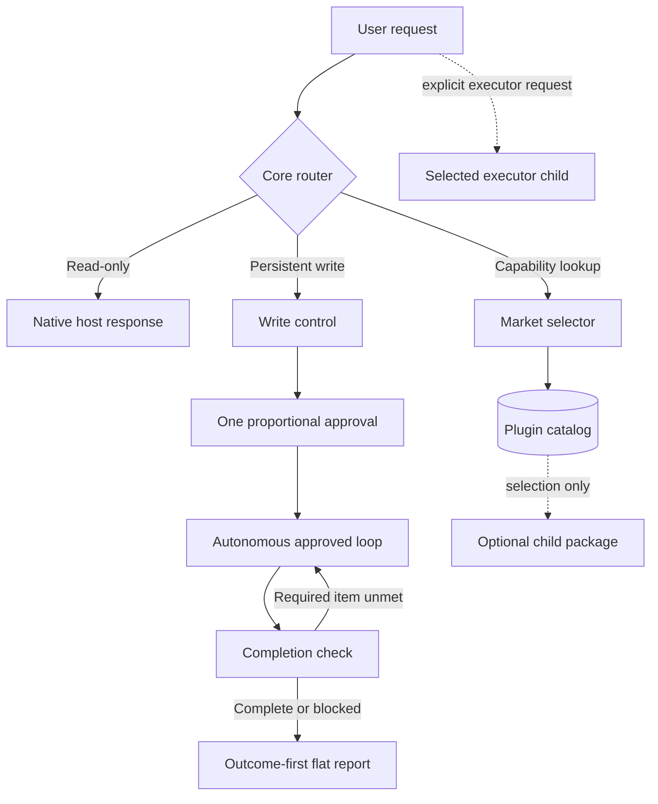

# Clonamic Agent Plugins

[](https://github.com/algocean1204/clonamic-herness-plugin/actions/workflows/ci.yml)
[](LICENSE)

Clonamic keeps read-only work direct, puts one proportional gate in front of persistent writes, and verifies required outcomes before reporting completion. The repository ships one core Agent Plugins 1.0.0 package and nine independently installable child packages.

한국어 요약: 질문과 읽기는 바로 처리합니다. 실제 쓰기는 범위에 맞는 승인 한 번만 받고, 승인된 수정·검증 루프는 필요한 결과가 나올 때까지 자율적으로 이어갑니다. 완료 보고는 결과와 증거를 먼저 보여 주는 평면 목록입니다.

## Packages

| Package | Owns | Does not own |
|---|---|---|
| `clonamic-herness-plugin` | Routing, write control, completion checks, outcome-first reports, market selection | Domain work, child installation |
| `clonamic-development` | Modular design, conservative patching, native gated Ultracode review | Approval, completion, external executors |
| `clonamic-preprocessing` | Input normalization, clarification packets, explicit queues and `loop_auto` | Scope inference, final execution |
| `clonamic-korean` | Korean prose-document clarity | Chat, work reports, code, spreadsheets, slides, email |
| `clonamic-ppt` | Editable presentation rendering and QA | General document editing, external execution |
| `clonamic-memory` | Explicit local store, recall, forget, link, and graph operations | Automatic context injection, hidden storage |
| `clonamic-grok` | One explicit bounded Grok CLI call | Automatic routing, retries, completion claims |
| `clonamic-gpt` | One explicit bounded Codex CLI call | Automatic routing, retries, completion claims |
| `clonamic-claude` | One explicit bounded Claude CLI call | Automatic routing, retries, completion claims |
| `clonamic-hermes` | One explicit bounded Hermes CLI call | Automatic routing, retries, completion claims |

Every child has its own root `plugin.json`, skill directory, MIT license, tests, and removal boundary. Installing the core does not imply that any child is installed.

## Operating contract

| Request | Route |
|---|---|
| Question, explanation, inspection, review, or status | Direct host response. No specification or approval. |
| Clear persistent write | One compact development specification and one approval. |
| Materially ambiguous persistent write | Work specification to lock intent, then one development specification before mutation. |
| Approved inspect/fix/retest/apply/deploy/backup loop | Continue autonomously inside the approved scope. |
| Completion claim | Compare every required item with current artifacts and fresh evidence. |
| Optional capability lookup | Market selects the narrowest matching package. Installation remains a platform action. |
| External executor | Only the executor explicitly named by the user. No substitution. |

Approval codes correlate a decision with its write packet. They are not passwords or authentication factors. Password, OAuth, biometric, operating-system, and platform prompts remain outside Clonamic.

## Runtime flow



## Install and selection

Install the core marketplace or package with the current host CLI:

```text
# Codex
codex plugin marketplace add algocean1204/clonamic-herness-plugin
codex plugin add clonamic-herness-plugin@clonamic

# Claude Code
claude plugin marketplace add algocean1204/clonamic-herness-plugin
claude plugin install clonamic-herness-plugin@clonamic

# Grok Build
grok plugin install algocean1204/clonamic-herness-plugin --trust

# Hermes
hermes plugins install algocean1204/clonamic-herness-plugin --enable
```

Review source before using `--trust` or `--enable`. Codex and Claude can install an optional child by its catalog name. Grok accepts a repository subdirectory selector such as `algocean1204/clonamic-herness-plugin#plugins/clonamic-development`. Hermes installs the portable root; child-package availability depends on the installed Hermes release and is not claimed without a host measurement.

Agent Plugins 1.0.0 clients load the repository root for the core package:

```text
plugin.json
skills/
native/
```

Optional packages are separate roots under `plugins/`:

```text
plugins/clonamic-development/
plugins/clonamic-preprocessing/
plugins/clonamic-korean/
plugins/clonamic-ppt/
plugins/clonamic-memory/
plugins/clonamic-grok/
plugins/clonamic-gpt/
plugins/clonamic-claude/
plugins/clonamic-hermes/
```

The root market can identify the package that matches a request. Agent Plugins 1.0.0 does not define portable child-plugin installation, so the host or user still installs and enables each selected child.

Platform manifests and adapter files are generated compatibility outputs. Do not edit `.agents/`, `.claude-plugin/`, `.grok-plugin/`, or generated adapter files by hand. Canonical behavior lives in the root and child `plugin.json` files, skills, native contracts, and catalog.

Structural router installation is optional and reversible:

```text
clonamic install-router <AGENTS.md> <install-state.json> <plugin-root>
clonamic uninstall-router <AGENTS.md> <install-state.json>
```

Release binaries include adjacent `.sha256` files. Verify the checksum before adding `clonamic` to `PATH`.

## Privacy and control

Clonamic has no telemetry. It does not copy credentials, user profiles, provider sessions, browser state, model settings, private paths, or implicit memory into the package. Runtime model IDs are not hardcoded. Executor wrappers use the selected provider CLI's default configuration plus options the user explicitly supplied.

Memory and preprocessing state always use caller-supplied paths. Recalled text and executor output are untrusted data, not instructions. Generated adapters translate discovery formats; they do not contain policy.

## Local verification

Core checks:

```bash
cargo fmt --check
cargo clippy --all-targets -- -D warnings
cargo test --all-targets
python3 scripts/validate-public.py
```

Each child also owns package-local tests. See [Contributing](CONTRIBUTING.md) for the split gate and child verification rules.

## Compatibility limits

Repository checks prove local contracts, manifest shape, deterministic code paths, and generated-file consistency. They do not prove that a particular host release installed, enabled, or enforced an adapter. Unsupported hooks use a declared model-side fallback. No live Grok validation success is claimed.

See [Compatibility](docs/COMPATIBILITY.md) for the measured-versus-fallback matrix.

## Documentation

- [Architecture](DESIGN.md)
- [Philosophy](docs/PHILOSOPHY.md)
- [Compatibility](docs/COMPATIBILITY.md)
- [Plugin boundaries](docs/plugin-boundaries.md)
- [Adapter generation](docs/adapters.md)
- [Migration and rollback](docs/migration.md)
- [Benchmark method](docs/BENCHMARKS.md)
- [Contributing](CONTRIBUTING.md)
- [Security](SECURITY.md)
- [Changelog](CHANGELOG.md)

## Status

Version 0.2.0 is an early public release. A release is ready only when the core, every included child, generated adapters, public-data scan, and rollback checks pass together.
